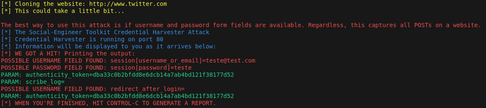

# Phishing for capturing passwords

### Tools

- Docker
- setoolkit

### Config Phishing on Docker

- Create image: ``` docker build -t setoolkit . ```
- Starting setoolkit: ``` docker run --network host -i setoolkit ```
- Type of attack: ``` Social-Engineering Attacks ```
- Attack Vector: ``` Web Site Attack Vectors ```
- Attack method: ```Credential Harvester Attack Method ```
- Attack method: ``` Site Cloner ```
- URL para clone: Exemple http://www.facebook.com

### Result

